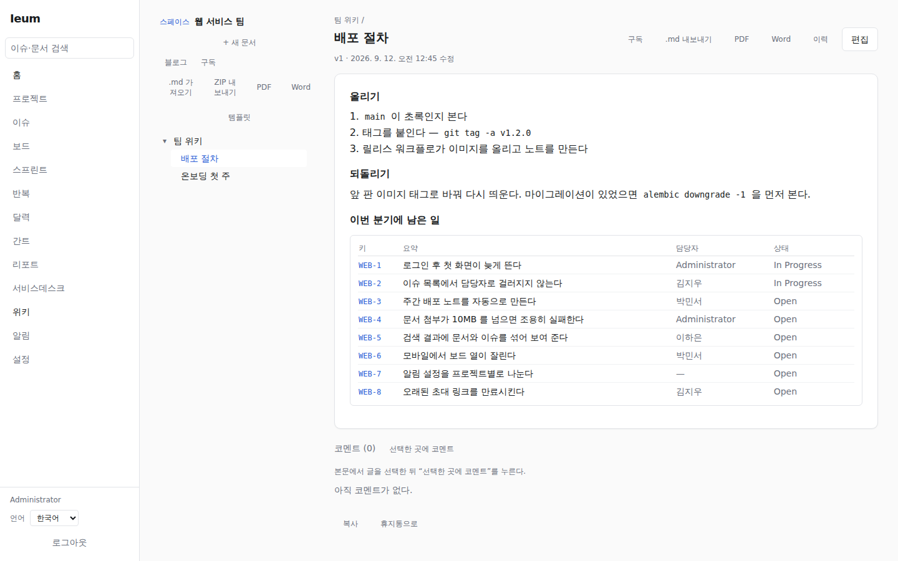
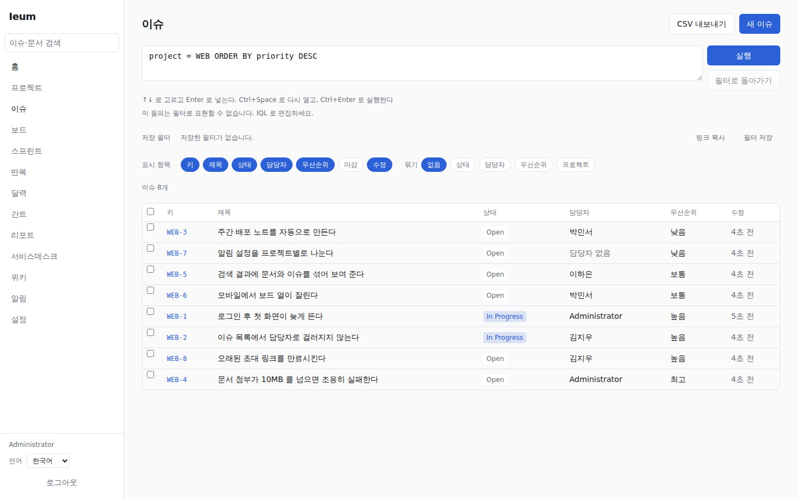
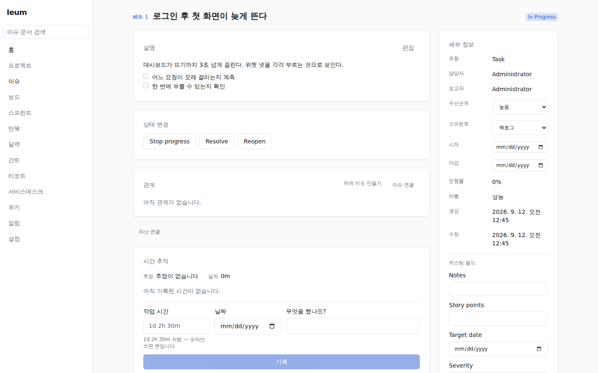
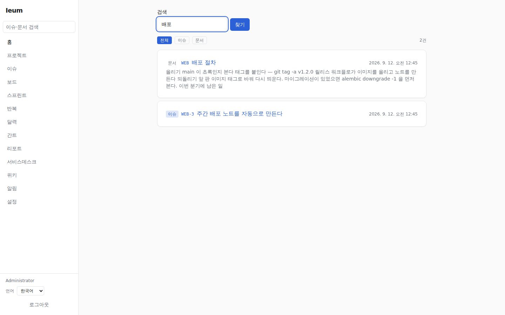
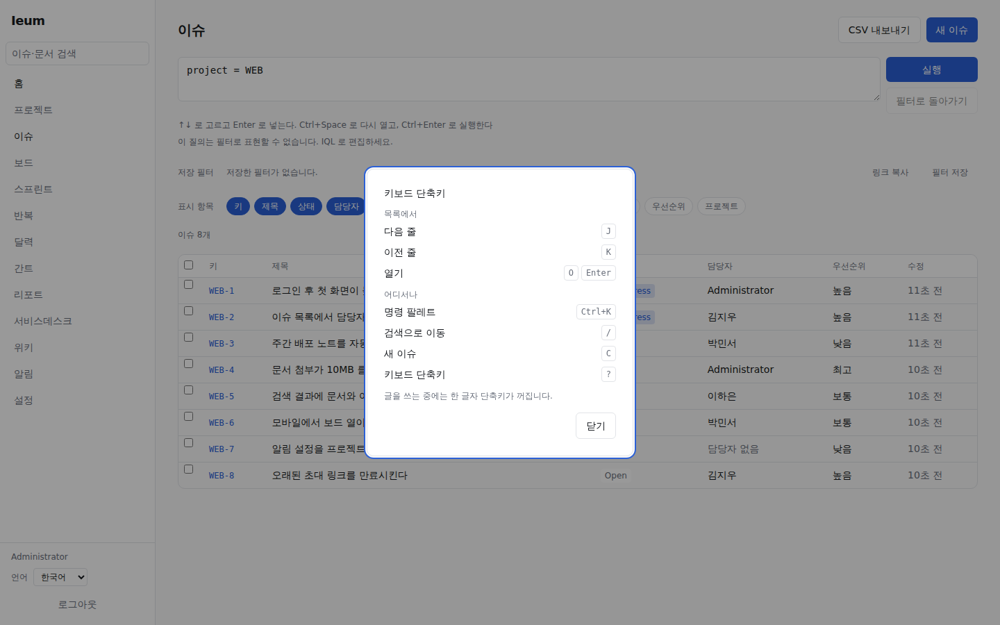
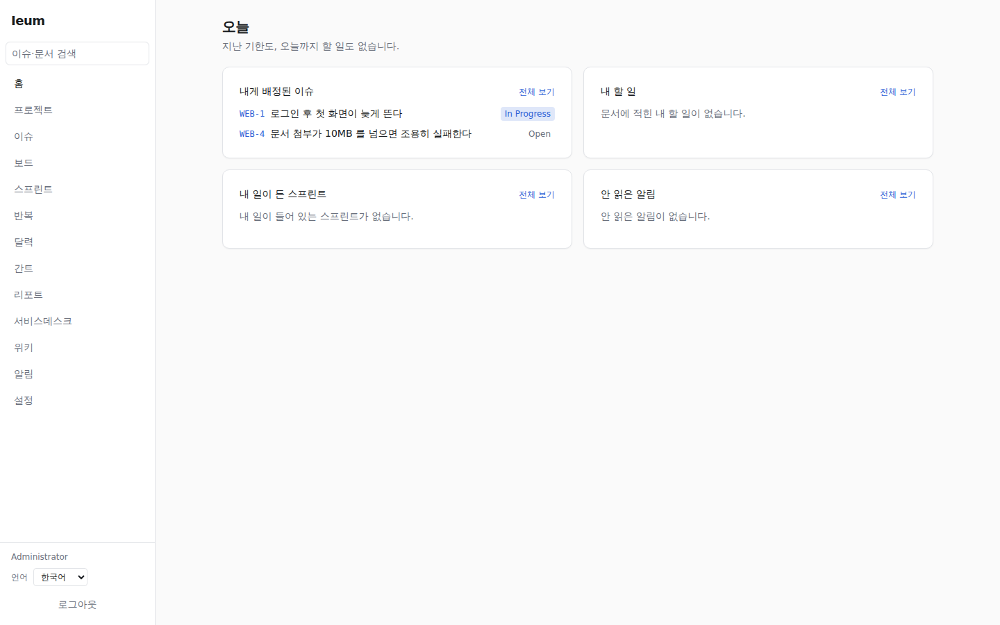

# Ieum (이음)

> *이음* — 한국어로 "잇는 것". 흩어진 이슈·문서·요청을 하나로 잇는다는 뜻.
> 영어권 발음 안내: **ee-eum**.

Jira + Confluence + JSM(서비스데스크)를 대체하는 **셀프호스팅** 팀 협업 플랫폼.
외부 SaaS 없이 자기 서버에서 통째로 돕니다.



세 제품이 **하나의 권한 모델, 하나의 검색, 하나의 알림** 위에 있습니다. 이슈에
붙은 문서와 문서에 붙은 이슈가 같은 검색 상자에서 나오고, 같은 역할 설정을
따릅니다.

- **이슈** — 프로젝트 계층, 커스텀 필드, 워크플로우, 시간 추적, 간트·캘린더,
  이슈 관계, 저장 필터, 칸반, 스프린트
- **위키** — 스페이스와 문서 트리, 판 비교, 인라인 코멘트, 템플릿, 매크로,
  동시 편집, `.md` 가져오기·내보내기
- **서비스데스크** — 고객 포털, 요청 유형, 큐, SLA, 이메일 채널, 승인 관문, CSAT

---

## 화면

### 질의가 곧 목록이다

목록·큐·저장 필터·문서 안의 이슈 표가 **전부 같은 질의 언어(IQL)** 를 씁니다.
한 곳에서 만든 질의를 다른 곳에 붙여 쓸 수 있습니다.



### 이슈 하나

설명은 마크다운이고 본문의 체크박스는 할 일로 셉니다. 상태는 **워크플로가 주는
전이**로만 움직입니다 — 아무 상태로나 바꾸지 못합니다.



### 문서가 이슈를 안다

문서 안에 `::issues{query="..."}` 를 적으면 **살아 있는 표**가 됩니다. 맨 위
사진의 "이번 분기에 남은 일" 이 그것 — 손으로 적은 목록이 아니라 그 문서를 열 때
질의한 결과입니다.

### 한 상자에서 둘 다 찾는다

이슈와 문서가 같은 결과 목록에 섞여 나옵니다. 한국어는 형태소로 색인합니다
(PGroonga).



### 마우스 없이

`Cmd/Ctrl+K` 팔레트, `c` 새 이슈, `/` 검색, `j`/`k`/`o` 목록 훑기, 이슈에서
`e`·`a`·`s`·`p`. **`?` 가 지금 화면에서 실제로 도는 것만** 보여 줍니다.

글을 쓰는 중에는 한 글자 단축키가 꺼집니다 — 코멘트에 "create" 를 쳐도 `c` 가
새 이슈를 열지 않습니다.



### 들어오면 보이는 것



---

## 띄워 보기

```bash
git clone https://github.com/pan889/Ieum.git && cd Ieum
cp .env.example .env
make secret          # 나온 값을 .env 의 IEUM_SECRET_KEY 에 넣습니다
make dev             # Postgres·Redis·MinIO·API·워커·웹이 함께 뜹니다
```

<http://localhost:5173> 을 열고 `.env` 에 적은 관리자 계정으로 들어갑니다.

운영 설치는 주소 셋(`IEUM_BASE_URL`·`IEUM_WEB_ORIGINS`·
`IEUM_S3_PUBLIC_ENDPOINT_URL`)을 실제 값으로 바꿔야 합니다. **비워 두면 기동을
거부합니다** — 조용히 개발 기본값으로 뜨는 것보다 안 뜨는 쪽이 낫기 때문입니다.

→ **[설치 안내](https://pan889.github.io/ieum-docs/install/)** 에 비밀 키 백업,
메일, 쿠버네티스(Helm), 백업·복구가 있습니다.

## 처음 할 일

| | |
|---|---|
| 프로젝트를 만든다 | 왼쪽 **프로젝트** → 새 프로젝트. 키(`WEB`)가 이슈 번호가 됩니다 |
| 사람을 부른다 | **설정 → 사람** 에서 초대. SSO(OIDC·SAML)와 SCIM 도 여기 |
| 위키 스페이스를 연다 | **위키** → 새 스페이스. `.md` 묶음을 그대로 올려도 됩니다 |
| 고객 창구를 연다 | **설정 → 포털**. 요청 유형이 곧 폼이고, 들어온 요청은 **서비스데스크** 의 큐에 담깁니다 |

→ **[쓰는 법](https://pan889.github.io/ieum-docs/guide/)** — 이슈·위키·검색·
데스크를 사람 순서로 설명합니다.

## 옮겨 오기

Redmine 에서 프로젝트를 옮기는 어댑터가 있습니다. **우리 서버는 소스 쪽으로
나가지 않습니다**(ADR-0016) — 관리자가 자기 기계에서 묶음을 뽑아 올립니다.

```bash
export REDMINE_API_KEY=...      # 명령줄 인자는 프로세스 목록에 남습니다
uv run --project apps/api python -m ieum.migrate.redmine \
    --url https://redmine.example.com --project my-project --out my-project.zip
```

Jira·Confluence·Zammad 어댑터는 아직 없습니다. 받는 쪽(묶음을 적재하는 화면)도
만드는 중입니다 — [로드맵](https://github.com/pan889/ieum-docs/blob/main/docs/roadmap.md).

## 만드는 사람에게

```bash
make test            # API 2,761개 + 웹 단위 555개
pnpm --filter @ieum/web exec playwright test    # 브라우저 265개
```

개발 규칙과 아키텍처 판단은 **문서 저장소가 단독으로 소유**합니다. 이 저장소에
사본을 두지 않습니다 — 두 벌을 두면 한 벌만 고쳐지는 날이 오기 때문입니다.

| | |
|---|---|
| 개발 규칙 | [CLAUDE.md](https://github.com/pan889/ieum-docs/blob/main/CLAUDE.md) |
| 로컬 실행 | [dev-setup.md](https://github.com/pan889/ieum-docs/blob/main/docs/contributing/dev-setup.md) |
| 아키텍처 | [overview.md](https://github.com/pan889/ieum-docs/blob/main/docs/architecture/overview.md) |
| 설계 판단(ADR) | [adr/](https://github.com/pan889/ieum-docs/tree/main/docs/adr) |
| 기능 전수 목록 | [feature-map.md](https://github.com/pan889/ieum-docs/blob/main/docs/product/feature-map.md) |
| 로드맵 | [roadmap.md](https://github.com/pan889/ieum-docs/blob/main/docs/roadmap.md) |

판마다 바뀐 것과 **어디까지 실제로 확인했는지**는 [CHANGELOG.md](CHANGELOG.md)
에 있습니다. 기능 목록보다 그쪽이 중요합니다.

위 사진은 `node tools/screenshots.mjs` 가 실제로 도는 앱에서 찍습니다. 화면이
바뀌면 손으로 고치지 말고 다시 돌리세요.

## 라이선스

AGPL-3.0-only
