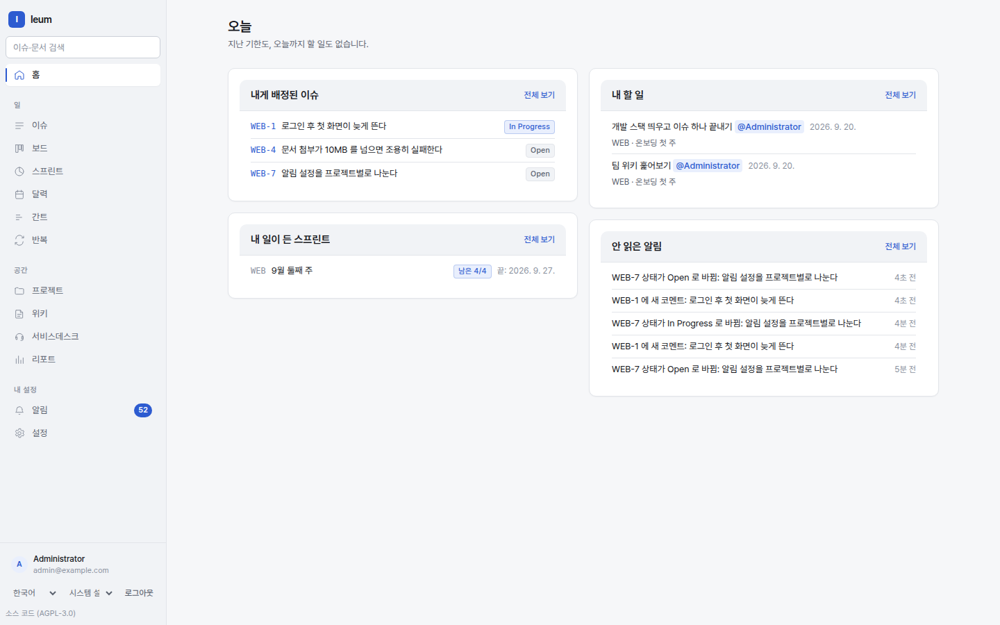

# 처음 둘러보기

로그인하면 **내 일**이 먼저 나옵니다. 나에게 할당된 이슈, 내가 담당인 티켓,
내가 체크박스로 받은 할 일, 그리고 안 읽은 알림이 한 화면에 있습니다.

왼쪽 메뉴는 하는 일로 **세 묶음**입니다.

| 묶음 | 메뉴 | 하는 일 |
|---|---|---|
| | **내 일** | 지금 나에게 온 것들 |
| 일 | **이슈** | 목록·검색·일괄 편집. IQL 로 좁힙니다 |
| 일 | **보드** | 칸반. 상태를 끌어서 옮깁니다 |
| 일 | **스프린트** | 스프린트와 번다운 |
| 일 | **캘린더 · 간트 · 반복** | 일정 세 가지 모양 |
| 공간 | **프로젝트 · 위키** | 일이 사는 곳과 문서가 사는 곳 |
| 공간 | **데스크** | 상담원 화면. 큐와 티켓 |
| 공간 | **리포트** | IQL 집계와 데스크 성과 |
| 내 설정 | **알림** | 인앱 알림과 워치 설정 |
| 내 설정 | **설정** | 사람·역할·워크플로우·포털·SLA·연동 |

맨 아래에는 지금 로그인한 계정과, **언어**·**화면 색**(밝게 / 어둡게 /
시스템 설정)을 고르는 자리가 있습니다. 화면 색은 이 브라우저에만 기억됩니다.




왼쪽이 메뉴, 가운데가 내 일입니다. 비어 있으면 "할 일도 없습니다" 라고 말해
주지, 빈 상자를 늘어놓지 않습니다.

## 30분 안에 해 보기

세 가지를 하면 이 도구가 어떻게 이어져 있는지 보입니다.

### 1. 프로젝트와 첫 이슈

`이슈 → 새 이슈`. 프로젝트가 없으면 `프로젝트 → 새 프로젝트` 로 하나
만듭니다. **키**(예: `ENG`)가 이슈 번호의 앞자리가 되고, 그 뒤로 바뀌지
않습니다 — 이슈 키(`ENG-1`)가 링크·커밋 메시지·메일에 남기 때문입니다.

만든 뒤 `보드` 에서 카드를 끌어 상태를 옮겨 보세요. 옮길 수 있는 곳은
워크플로우가 정합니다.

→ [이슈와 프로젝트](issues.md)

### 2. 스페이스와 첫 문서

`위키 → 새 스페이스`. 문서를 하나 만들고 본문에 이걸 적어 보세요.

```
::issues[project = ENG AND status != Done]
```

저장하면 그 자리에 **이슈 목록이 표로** 그려집니다. 문서가 이슈를 알고,
이슈 쪽에서도 그 문서를 역으로 찾습니다.

→ [위키](wiki.md)

### 3. 포털과 첫 티켓

`설정 → 포털` 에서 포털을 하나 만들고 요청 유형을 더합니다. 포털 주소를
브라우저에 열면 **고객이 보는 화면**입니다 — 로그인한 상담원 화면과 다르게
생겼고, 고객은 자기 요청만 봅니다.

포털로 요청을 하나 내고 `데스크` 로 돌아오면, 그것이 **이슈로** 와 있습니다.
답을 쓸 때 `고객에게 회신` 과 `내부 노트` 가 갈립니다 — 내부 노트는 고객에게
안 보입니다.

→ [서비스데스크](desk.md)

## 알아 두면 덜 헤매는 것

**권한은 스코프에 붙습니다.** 전역 · 프로젝트 · 스페이스 · 큐 네 층이고,
역할을 그 스코프에 할당합니다. "이 프로젝트에서만 관리자" 가 됩니다.

**민감한 설정은 2FA 를 다시 묻습니다.** 역할·IdP·워크플로우·웹훅처럼
보안을 바꾸는 자리는 로그인만으로 열리지 않고, 최근 5분 안에 2FA 를 통과한
세션만 만질 수 있습니다. 화면이 그때 다시 묻습니다.

**목록은 언제나 검색입니다.** 이슈 목록, 큐, 저장 필터, 문서의 `::issues`
매크로 — 전부 같은 IQL 을 씁니다. 한 곳에서 만든 질의를 다른 곳에 붙여
쓸 수 있습니다.

→ [검색과 IQL](search.md)

**편집기 안에서 `/` 와 `@` 가 목록을 엽니다.** `/` 는 넣을 블록(표·코드·
경고 상자·목차·이슈 목록 …)을, `@` 는 사람을 고르는 목록입니다. 디렉티브
문법을 외울 필요가 없게 하려는 것이고, 두 모드(소스·서식)가 같은 목록을
씁니다.

IQL 을 적는 칸에서는 값을 제안하고, `Esc` 로 목록을 닫고
`Ctrl`(macOS 는 `Cmd`)`+Enter` 로 실행합니다.

**어디서나 쓰는 키가 넷 있습니다.**

| 키 | 하는 일 |
|---|---|
| `Ctrl`/`Cmd` + `K` | 명령 팔레트 — 갈 곳, 만들 것, 찾을 말을 한 칸에서 |
| `c` | 새 이슈 |
| `/` | 검색 칸으로 |
| `?` | 이 목록 보기 |

이슈 목록에서는 `j`/`k` 로 줄을 옮기고 `o` 또는 `Enter` 로 엽니다.
이슈를 열면 `e` 편집, `a` 담당자, `s` 상태 전이, `p` 우선순위입니다.
`?` 는 **지금 쓸 수 있는 것만** 보여 주므로 화면마다 내용이 다릅니다.
팔레트와 도움말은 `Esc` 로 닫습니다 — 떠 있는 동안에는 뒤의 단축키가 쉬므로,
도움말을 띄운 채 `c` 를 눌러도 새 이슈 화면으로 가지 않습니다.

`s` 와 `p` 는 값을 고르지 않고 그 자리로 **데려갑니다** — 고르는 것은
화살표와 `Enter` 로 합니다. 선택 상자 안에서는 한 글자 키가 꺼지므로,
`p` 로 간 뒤 `s` 를 누르려면 상자에서 먼저 나와야 합니다.

화면이 서른 개가 넘고 그중 스물은 설정 아래에 있습니다. 팔레트는 그것을
외우지 않아도 되게 합니다 — 이름 일부만 치고 `Enter` 입니다. 이름이 안 맞으면
친 말을 그대로 검색합니다.

**글을 쓰는 중에는 한 글자 키가 꺼집니다.** 코멘트에 "create" 를 쳐도 `c` 가
새 이슈를 열지 않습니다. 뚫고 들어오는 것은 `Ctrl`/`Cmd`+`K` 하나뿐입니다.

그 밖의 이동은 표준 `Tab`·`Enter` 입니다 — 화면마다 다른 단축키를 외우게
하지 않는다는 판단이고, 접근성 목표도 그쪽입니다(WCAG 2.1 AA 지향).
