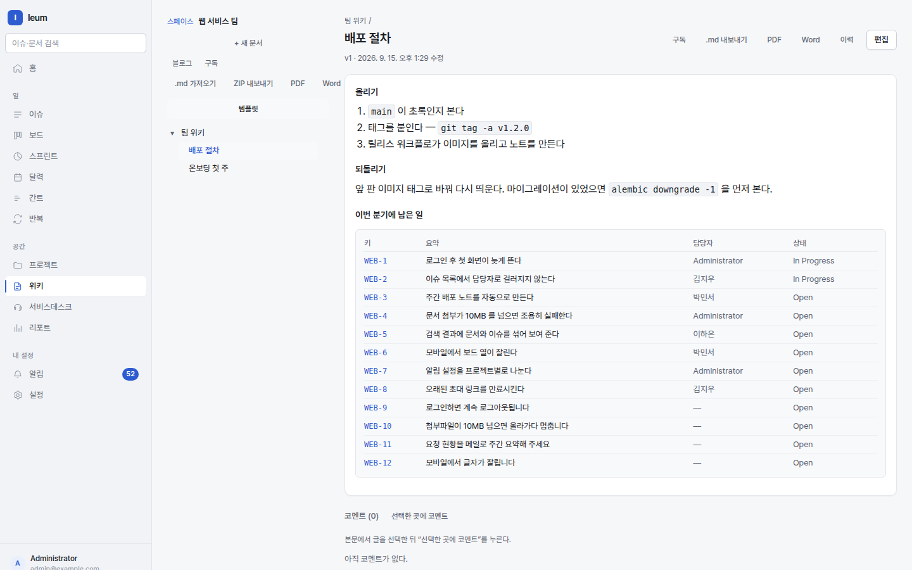

# 위키

위키는 **팀의 문서가 사는 곳**입니다. 이슈와 같은 검색·권한·알림 위에 있어서,
문서에서 이슈를 부르고 이슈에서 그 문서를 되찾을 수 있습니다.

문서 본문 안의 `::issues` 가 **살아 있는 표**로 그려집니다. 손으로 적은 목록이 아니라 문서를 열 때 질의한 결과입니다.

## 스페이스와 문서

스페이스는 문서가 담기는 곳이고 **권한이 붙는 자리**입니다. 종류가 둘
있습니다.

- **팀** — 보통의 문서 공간
- **KB** — 서비스데스크가 고객에게 추천할 수 있는 공간

문서는 트리입니다. 경로가 `스페이스키/부모/자식` 이고, 그 경로가 곧 주소입니다.

## 쓰기

편집기가 두 모드입니다. **같은 문서를 같은 마크다운으로** 저장합니다 —
모드는 보는 방식일 뿐입니다.

| 모드 | 언제 |
|---|---|
| **소스** | 마크다운을 직접 쓸 때, 디렉티브를 손으로 고칠 때 |
| **서식** | 표를 만들거나 붙여넣은 서식을 그대로 살릴 때 |

`/` 로 넣을 블록 목록이 열립니다. `@` 로 사람을 부릅니다.

다른 곳에서 **서식 있는 글을 붙여넣으면 마크다운이 됩니다.** 구글 문서·워드·
웹 페이지에서 가져온 표와 목록이 모양을 유지합니다. 색깔만 입힌 코드는
손대지 않습니다.

### 자동 저장

편집 중인 것은 **내 초안**으로 자동 저장됩니다. 창을 닫아도 남아 있고,
다시 열면 "이어서 쓸까요" 를 묻습니다. 게시할 때까지 남에게는 안 보입니다.

## 여러 사람이 같이 쓰기

같은 문서를 동시에 열면 서로의 커서와 이름이 보이고, 글자가 실시간으로
섞입니다. 충돌 창이 뜨지 않습니다 — 텍스트 CRDT 라서 순서와 무관하게 같은
결과가 됩니다.

!!! note "붙기 전에 쓴 글"
    소켓이 붙기 전에 이미 쓰고 있던 글이 있으면, 붙을 때 그것을 공유 문서로
    **가져갑니다.** 다만 그 사이에 남이 같은 문서를 고쳤다면 가져가지 않고
    알려 줍니다 — 두 사람의 글을 기계가 섞는 것보다 사람이 보는 쪽이 낫기
    때문입니다.

## 판과 비교

게시하면 판이 하나 생깁니다. `판` 에서 두 판을 골라 줄 단위로 비교하고,
되돌릴 수 있습니다.

**자동 저장은 판을 만들지 않습니다.** 만들면 이력이 3초마다 한 줄씩
오염됩니다.

## 코멘트

문장을 골라 코멘트를 달면 그 자리에 붙습니다. 본문이 바뀌어도 **비슷한 자리를
찾아** 따라갑니다. 못 찾을 만큼 바뀌면 "고아" 로 표시되고 문서 아래로
모입니다 — 조용히 사라지지 않습니다.

## 매크로(디렉티브)

문서 안에서 다른 것을 끌어옵니다.

| 쓰기 | 그려지는 것 |
|---|---|
| `::toc` | 이 문서의 목차 |
| `::children{depth=2}` | 하위 문서 목록 |
| `::issues[project = ENG AND status != Done]` | IQL 결과 표 |
| `::chart[project = ENG]{by=status kind=bar}` | IQL 집계 그림 |
| `::excerpt[ENG/deploy]` | 다른 문서의 앞부분 |
| `:::info` … `:::` | 강조 상자 (`note`·`warning`·`danger` 도) |

읽을 수 없는 매크로는 **저장을 막습니다.** 저장된 뒤에 깨진 상자로 보이는
것보다 낫습니다.

## 가져오기와 내보내기

`.md` 파일을 올리면 문서가 됩니다. 상대 경로로 걸린 이미지는 **첨부로
흡수합니다** — 안 하면 링크가 다 깨집니다.

내보내면 `.md` 와 첨부가 ZIP 하나로 나옵니다. 올린 것을 내리면 같은 것이
나옵니다(라운드트립).

PDF·Word 로도 내립니다. 조판은 **앱 안에서** 하므로 헤드리스 브라우저가
필요 없고, 한국어 글꼴이 이미지에 들어 있습니다.

## 블로그

스페이스마다 블로그가 있습니다. 트리에 넣지 않고 **날짜 순으로** 쌓이는
글이고, 공지·주간 노트에 씁니다.

## 알림

문서나 스페이스를 워치하면 바뀔 때 알림이 옵니다. 하나하나 받는 것과
**모아 받는 것**(다이제스트)을 고를 수 있고, 다이제스트는 받는 사람의 지역
시각에 맞춰 나갑니다.
